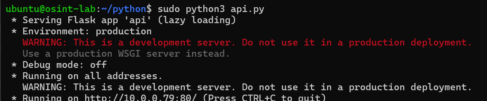

# 🔎 API Reconnaissance Lab (Oracle VM)

APIs often expose more sensitive information than web pages. Attackers specifically look for deprecated endpoints, unsecured routes, and weak authentication.
This lab sets up a custom API on an Oracle Cloud VM, then runs enumeration and fuzzing to simulate reconnaissance.

## ⚙️ Setup
### Environment
- Oracle VM (Ubuntu)
- Exposed ports: 22 (SSH), 80 (HTTP)
- Security: NSGs + Subnet Security + iptables rules

### Installed packages
```bash
sudo apt install python3-pip -y
pip install flask flask-restx
```

## API Server
made a fie:
```bash
mkdir python
nano api.py
```
and,
I made the API server using Flask and Flask_restx:
```python
from flask import Flask, request
from flask_restx import Api, Resource, fields

app = Flask(__name__)
api = Api(app, version="1.0", title="Demo API", description="A simple test API")

ns = api.namespace("users", description="User operations")

user_model = api.model("User", {
    "id": fields.Integer(readonly=True),
    "name": fields.String(required=True, description="The user name")
})

users = [
    {"id": 1, "name": "Alice"},
    {"id": 2, "name": "Bob"}
]

@ns.route("/")
class UserList(Resource):
    @ns.marshal_list_with(user_model)
    def get(self):
        """List all users"""
        return users

    @ns.expect(user_model)
    @ns.marshal_with(user_model, code=201)
    def post(self):
        """Create a new user"""
        new_user = api.payload
        new_user["id"] = len(users) + 1
        users.append(new_user)
        return new_user, 201


@ns.route("/<int:id>")
@ns.response(404, "User not found")
class User(Resource):
    @ns.marshal_with(user_model)
    def get(self, id):
        """Fetch a user by ID"""
        for u in users:
            if u["id"] == id:
                return u
        api.abort(404)

if __name__ == "__main__":
    app.run(host="0.0.0.0", port=80)
```
- I had to stop apache2 from running on port 80 for the API to run properly.
```bash
sudo systemctl stop apache2
```

Ran it with:
```bash
sudo python3 api.py
```
result:


## 🕵️ Reconnaissance
### Manual Curl Testing
```bash
curl -i http://140.245.xxx.xxx/users/
curl http://140.245.xxx.xxx/users/1
```
result:
- I got both users i made.
- from the second command i got the first user.


### Creating new user
```bash
curl -I --X POST http://140.245.xxx.xxx/users/ \
-H "Content-Type: application/json" \
-d '{"name": "charlie"}'
```
and when accessing the third user using:
```bash
curl http://140.245.xxx.xxx/users/3
```
i got:


## Fuzzing with FFUF
Default SecLists didn't detect `/users` or `/swagger.json` because wordlist lacked API-centric requests (I tried it and i was only getting 404s on the Flask API end), so i made a new wordlist for recon.

```bash
nano ~/api-endpoints.txt
```
its content were:
```txt
users
users/1
users/2
swagger.json
```

Command used:
```bash
ffuf -u http://140.245.xxx.xxx/FUZZ -w ~/api-endpoints.txt
```
Result:
- got the `/users`, `/users/1`, `/users/2` and `/swagger.json`


## 🧠 Lessons Learned
- **Generic wordlists** ≠ enough for APIs. API fuzzing requires tailored lists (users, swagger.json, v1/, etc.).
- Cloud networking adds complexity — I had to debug NSGs, iptables, and ISP filtering before API was even reachable.
- Recon isn’t about tools only — it’s about why a request fails (blocked vs misconfigured vs wrong wordlist).
- This setup simulates real-world API recon where initial access often comes from undocumented endpoints.

## 🔗 OWASP API Top 10 Mapping
- Excessive Data Exposure (API3:2023) → `/users` leaks full user objects without auth.
- Broken Object Level Authorization (API1:2023) → `/users/1`, `/users/2` directly expose user IDs without auth checks.